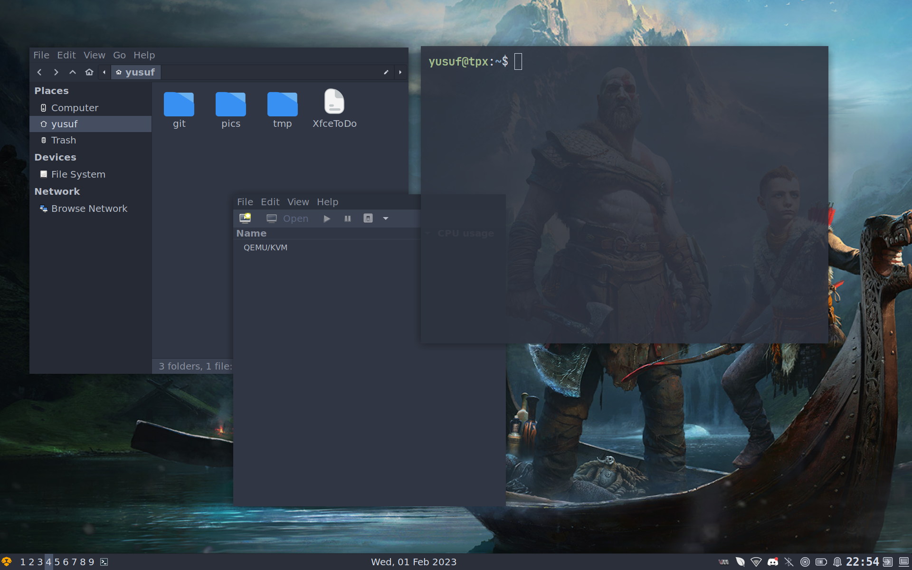

# xfce4-dotfiles
Pardus Xfce Dotfiles

```bash
~/.config/gtk-3.0/gtk.css
~/.local/share/xfce4/terminal/colorschemes/nord.theme
~/.config/xfce4/xfconf/xfce-perchannel-xml/xfce4-keyboard-shortcuts.xml
~/.config/xfce4/xfconf/xfce-perchannel-xml/xfce4-panel.xml
```

```
Super + 1,2,3..9 		Change workspace
Super + Shift + Enter 		Xfce4Terminal(tabbed)
Super + Shift + C		Close window
Alt + Shift + 1,2,3...9		Move window to workspace X
Super + P			App finder
Super + H			Tile window left
Super + L			Tile window right
Super + J			Hide window
Super + K			Maximize window
Ctrl + Alt + L			Lock screen
```



